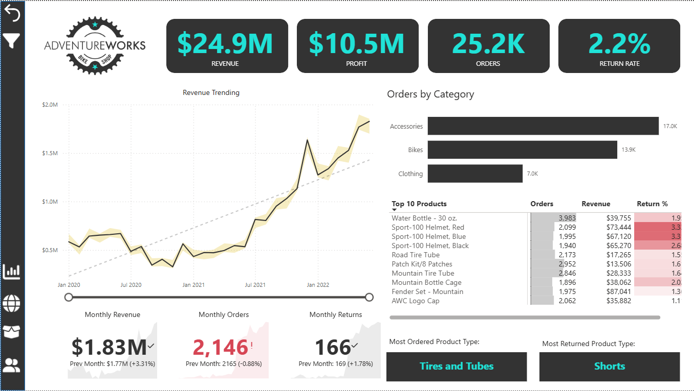
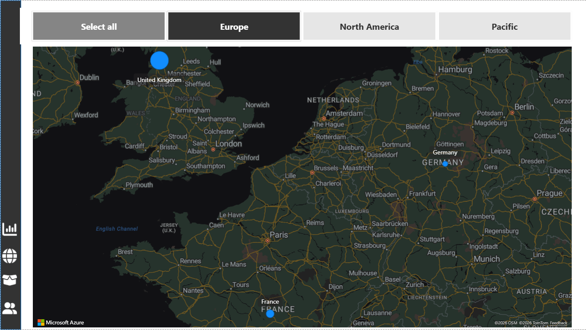
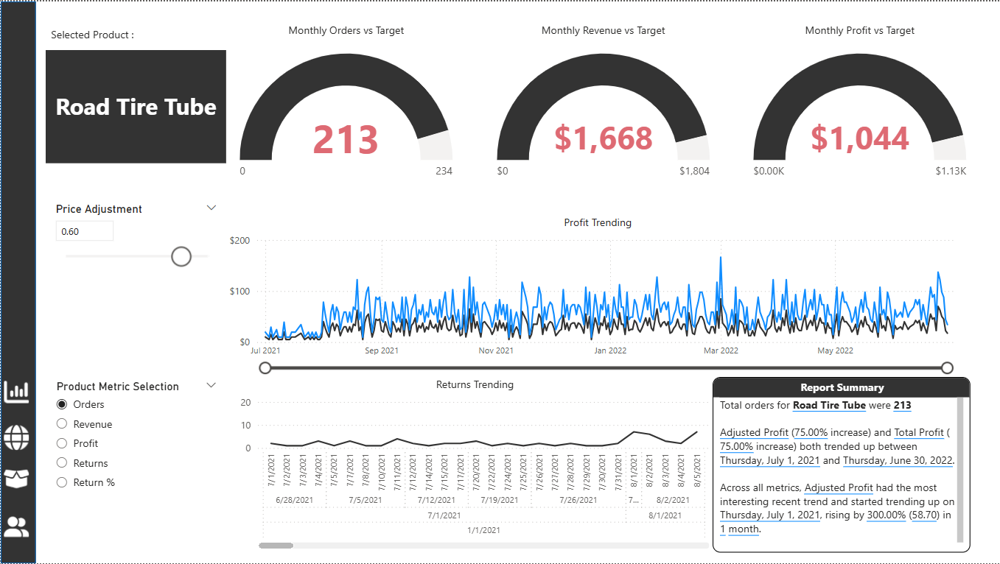
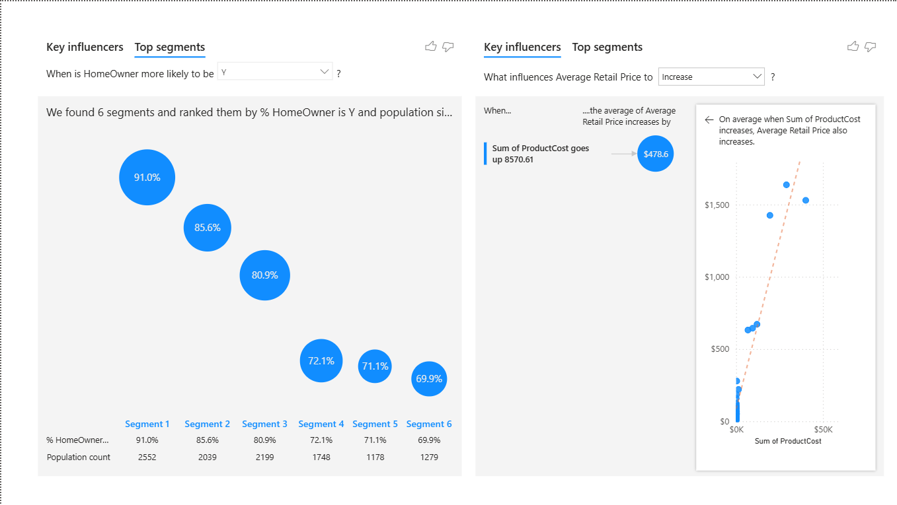
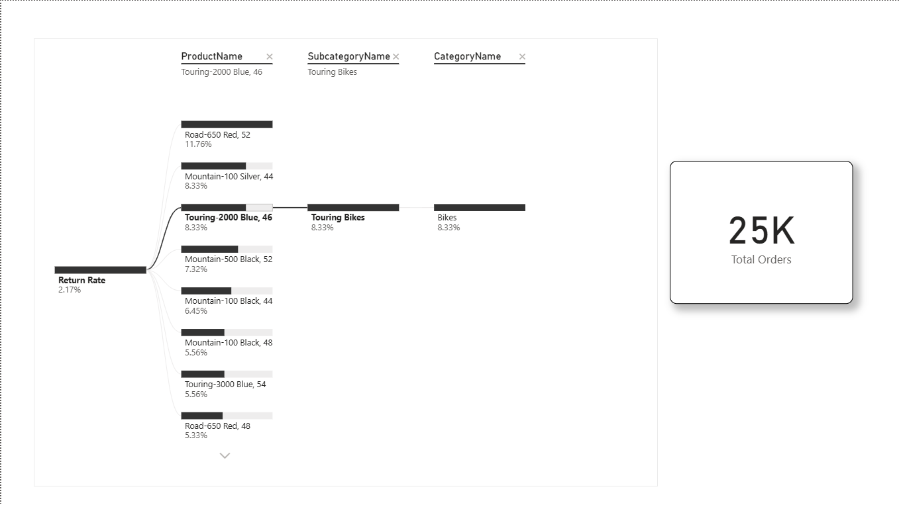

# Sales Performance & Customer Insights Dashboard (Power BI)

## Project Overview

This project demonstrates a **Power BI business intelligence dashboard** built to analyze sales performance, customer behavior, and product trends.

The goal of this dashboard is to help business stakeholders identify:

- Revenue trends
- Regional performance
- Product demand
- Customer insights
- Key drivers of sales performance

---

## Tools Used

- Power BI
- DAX
- Data Modeling
- Data Visualization
- Business Intelligence

---

# Dashboard Pages

## Executive Dashboard

---

## Sales Map

  

---

## Product Details

---

## Customer Detail

---

## Key Influencers

---

## Decomposition Tree

---

## Business Insights

From this dashboard, decision makers can:

- Identify high performing regions
- Understand product demand trends
- Analyze customer behavior
- Discover key factors driving sales

---

## Author

Belal Kadejah  
Senior Business & Product Analyst
